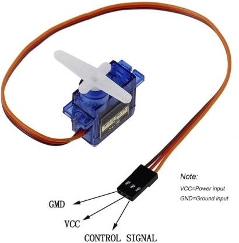
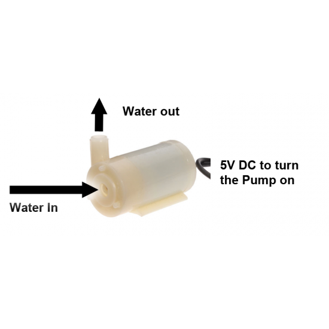
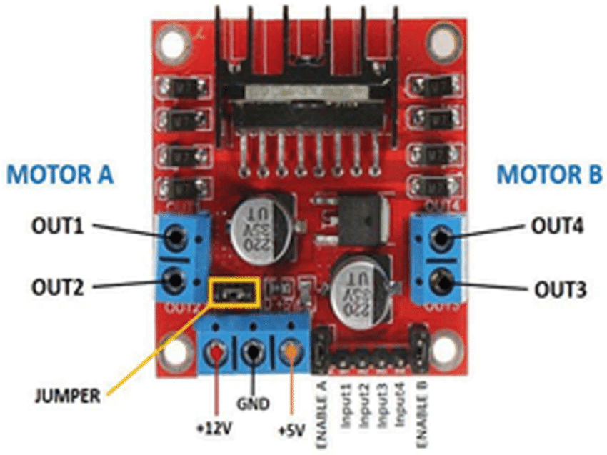
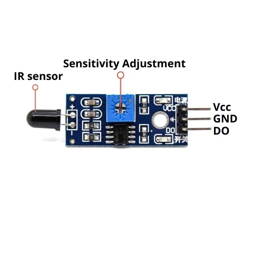
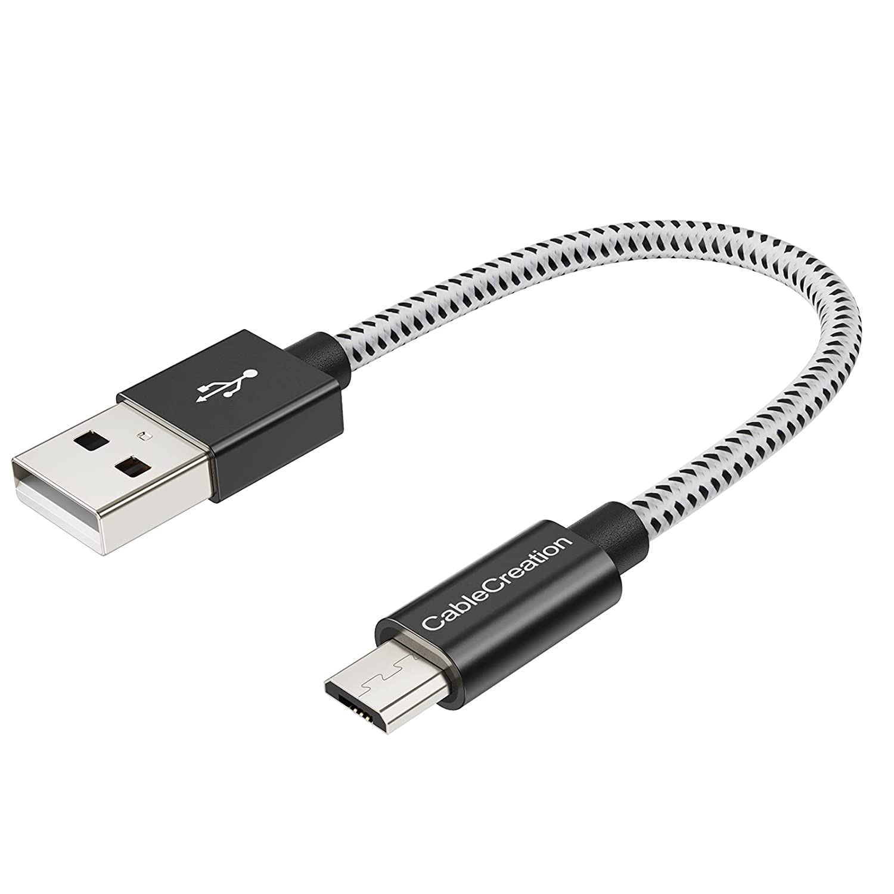
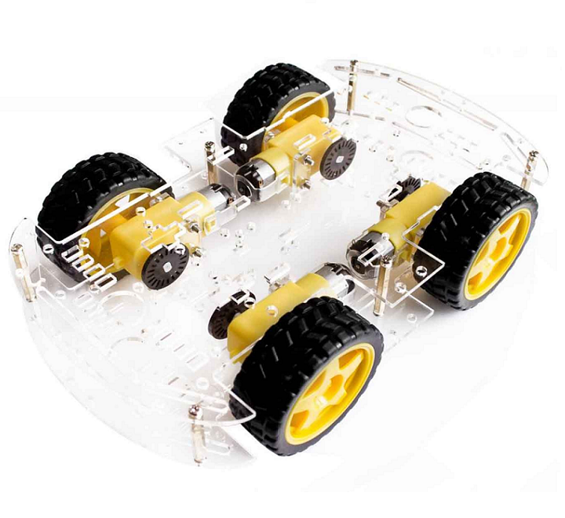
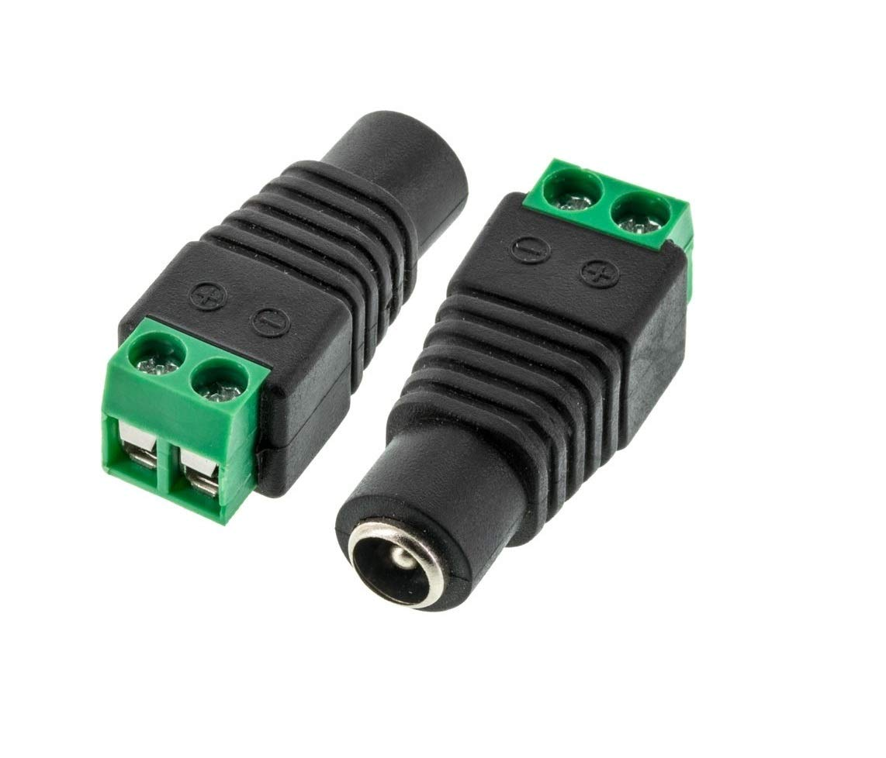

# Components
1. Arduino UNO  

2. Servo Motor 

3. Mini DC Submersible Pump 

4. L298 motor driver module

5. L293D Motor Driver Module 

6. Flame sensor module

7. USB-A to Micro-USB cable

8. Car chassis

9. 12V Battery
10. On-Off- Switch
11. DC Female Connector Jack 

12. Connecting wires

# Software
Arduino IDE
